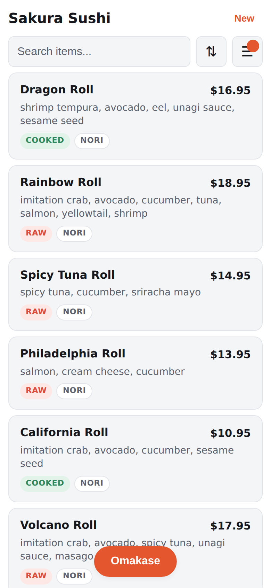

# Sushi Selector

A mobile-first web app that turns a photo of a restaurant menu into a
filterable, searchable list of items with ingredients and prices. Point your
phone at the menu, tap parse, and get answers in under 30 seconds.

<p align="center">
  
  &nbsp;&nbsp;
  
</p>

## How it works

```
Phone camera
  |  photos (up to 6 pages)
  v
Client (vanilla JS, no framework)
  |  EXIF fix, downscale to 1568px, JPEG quality ladder
  v
Cloudflare Worker (TypeScript, thin proxy)
  |  Turnstile bot check, HMAC session token, rate limits
  v
Anthropic API (Haiku 4.5, structured outputs)
  |  Pass 1: index (items, prices, sections)
  |  Pass 2: details (ingredients, wrap type, raw/cooked)
  v
Client merges, dedupes, normalizes ingredients
  v
Filterable results list
```

The worker is intentionally thin: it authenticates, validates, rate limits,
and proxies. All orchestration, merging, and rendering happen in the browser.
The intelligence lives in `shared/prompts/` and `shared/schema/`, not in
worker code.

## Project status

| Phase | Status | What it covers |
|-------|--------|----------------|
| 0. Scaffold | Done | Repo layout, wrangler config, static shell, eval harness skeleton |
| 1. Extraction | Done | Schemas, prompts, worker proxy, client pipeline, eval harness, CI |
| 2. UI | Done | Filter sheet, cards, Omakase shuffle, PWA, mobile styling |
| 3. Hardening | Done | Turnstile, HMAC tokens, rate limits, CORS, payload caps, negative tests |
| 4. Ship | In progress | Deploy workflow, README, final eval run, acceptance checklist |

## Security controls

| Layer | Control | What it stops |
|-------|---------|---------------|
| Financial | Anthropic workspace spend cap ($5/month) | Every other control failing at once |
| Bot | Cloudflare Turnstile, verified server-side | Scripted abuse of the public endpoint |
| Endpoint auth | HMAC session token, 10 min TTL | Replay and direct curl of extract endpoints |
| Throughput | Rate limit: 6/60s per token (extract), 3/60s per IP (session) | One abusive client |
| Input | 1.5 MB payload cap, media_type allowlist, max 10 items per batch | Oversized or malformed requests |
| Blast radius | Model and max_tokens pinned server-side | Prompt or parameter injection from the client |
| CORS | Origin allowlist (no wildcard) | Browser-origin confusion (advisory, token is the real guard) |

All controls verified with negative tests: `node scripts/verify-controls.mjs`
(report in `evals/reports/phase3-verification.txt`).

## Eval results

Latest eval report: `evals/reports/2026-07-25-r4-dinner.md` (Restaurant 1, dinner menu)

| Gate | Threshold | Result |
|------|-----------|--------|
| Item recall | >= 0.97 | See latest report |
| Item precision | >= 0.97 | See latest report |
| Ingredient F1 (macro) | >= 0.90 | See latest report |
| Price accuracy | >= 0.97 | See latest report |
| Consistency (repeat) | F1 spread <= 0.03 | See latest report |

Full eval run blocked on ANTHROPIC_API_KEY configuration (Tom's preflight).
Reports committed to `evals/reports/` with each prompt iteration.

## Repo layout

```
public/              static frontend (vanilla JS, no build step)
  app.js             orchestrator state machine
  ui.js              rendering, filter sheet, cards, Omakase
  filters.js         pure filter/sort/search functions
  preprocess.js      image normalization and downscale
  aliases.js         loads shared/aliases.json via API
  sw.js              service worker (static asset caching only)
  index.html         single-page app shell
  styles.css         mobile-first styling with dark mode

src/                 Cloudflare Worker (TypeScript, compiled by wrangler)
  worker.ts          router, validation, CORS, payload caps
  extract.ts         Anthropic API request construction
  session.ts         Turnstile siteverify + HMAC session tokens
  ratelimit.ts       native rate limit binding wrapper

shared/              versioned extraction artifacts (the product)
  prompts/           system prompt, index/details/url task prompts
  schema/            JSON schemas for structured output
  aliases.json       canonical ingredient mappings

evals/               extraction quality measurement
  run_evals.py       eval harness (Python, managed by uv)
  menus/             golden set with hand-labeled data
  reports/           scored eval reports (committed with prompt changes)

scripts/             development utilities
  verify-controls.mjs  Phase 3 negative-test harness
  screenshot.mjs       Playwright screenshot capture for README

docs/                architecture and planning
  SPEC.md            contracts, schemas, UI spec, orchestration
  HANDOFF.md         mission, phases, acceptance checklist
  EVALS.md           quality gates and golden set workflow
  DEPLOY.md          accounts, secrets, deployment steps

.claude/             Claude Code tooling
  agents/            infra-mentor, qa-runner, security-reviewer
  skills/            golden-drafter, deploy-checklist
  settings.json      project permission defaults

.github/workflows/   CI (typecheck, eval check, secrets scan) + deploy
.githooks/           pre-commit: secrets guard + eval gate
```

## Running locally

### Prerequisites

- Node.js 22+
- [uv](https://docs.astral.sh/uv/) (Python package manager for the eval harness)

### Dev server

```sh
npm ci
npx wrangler dev
# Worker + static assets at http://localhost:8787
# POST /api/health to confirm
```

Create `.dev.vars` (gitignored) with your secrets:

```
TURNSTILE_SECRET_KEY=your-turnstile-secret
SESSION_HMAC_SECRET=any-random-string-for-local-dev
ANTHROPIC_API_KEY=sk-ant-...
```

### Eval harness

```sh
# Offline check (free, no API calls)
uv run evals/run_evals.py --check

# Scored run (needs API key)
uv run evals/run_evals.py --menu km-sushi-nigiri   # single menu
uv run evals/run_evals.py --all                     # full run
uv run evals/run_evals.py --all --batch             # half price, slower
uv run evals/run_evals.py --all --repeat 3          # consistency check
```

### Security control verification

```sh
# Start dev server, then in another terminal:
node scripts/verify-controls.mjs
```

### Git hooks (optional)

```sh
git config core.hooksPath .githooks
```

Enables two pre-commit checks:
1. Blocks commits containing secret assignments in source files
2. Blocks `shared/` changes without an accompanying eval report

## Architecture decisions

**Why vanilla JS?** The state surface is one job object and one filter object.
A framework adds bundle size and build complexity for no benefit on a
single-page, single-purpose app.

**Why a thin Worker proxy?** The Workers free plan has no wall-clock duration
limit for HTTP requests, and time spent awaiting fetch does not count toward
the 10ms CPU budget. A thin I/O-bound proxy fits the platform perfectly.

**Why two extraction passes?** The index pass (items + prices) is cheap and
fast. The details pass (ingredients per item) is heavier. Splitting them
enables warm-then-fan-out caching: batch 1 warms the prompt cache, then
batches of 8 run at concurrency 3 against the warm cache at reduced cost.

**Why HMAC tokens instead of JWTs?** Same idea (signed payload with expiry),
less bloat. One Turnstile solve authorizes one 10-minute parse session. The
token is unforgeable, short-lived, and deliberately not IP-bound because
phones change IPs mid-session.

## Cost model

- Per menu parse: ~$0.03-0.08 on Haiku 4.5 (varies by menu density and photo count)
- Full eval run: ~$0.25-0.50 with caching, half with `--batch`
- Workspace spend cap: $5/month (set in Anthropic Console, hard stop)

## Contributing

See [CLAUDE.md](CLAUDE.md) for repo conventions. Key rules:
- No em dashes anywhere (code, docs, commits, UI copy)
- Prompt and schema changes must ship with an eval report
- Secrets never in code, config, or git history
- Python managed by uv, never pip directly
- Frontend is vanilla JS, no frameworks, no build step
